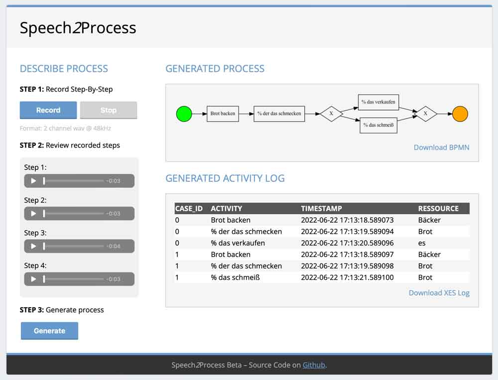

# Speech*2*Process

Speech*2*Process is a tool to transform natural language (by text oder audio recorded) to BPMN process (incl. EventLog). This tool is part of a research paper.

### Features
1. Transcribe audio to text (optional)
2. Extract tasks (events) via NLP tool spaCy
3. Generate simple EventLog for PM4PY
4. Process Mining algorithm for BPMN creation

### Feature Requests:
* Modus: Instance based (new) vs. Single Instance Intelligence (implemented)
* Annotations (e.g. improvment in records)
* New specific name 

View the [Demo](#demo) screenshot and the [research paper](#research-paper) in german.

## Installation

Get project by:

```git clone https://github.com/bitnulleins/speech2process.git```

### Dependencies

You need **Python** and some Python libraries: [requirments.txt](./requirements.txt)

```pip install -r requirments.txt```

### PM4PY

Read the [installation manual](https://pm4py.fit.fraunhofer.de/install) to install PM4PY on your machine. 

**Problems with pm4py and *CVXOPT*?**

I also had, but CVXOPT is not necessary. Try the manually [Linux ARM](https://pm4py.fit.fraunhofer.de/install-page#linux-ARM) instructions:
1. Make sure you have a C/C++ compiler ```gcc -v```
2. Install all needed pm4py Python library (if not already installed):
```
sudo pip3 install pyvis graphviz pydotplus pytz intervaltree deprecation tqdm stringdist pyemd jsonpickle sympy pandas==0.25.3
```
3. Install pm4py without dependencies (and without CVXOPT): ```pip3 install --no-deps pm4py```

### Install 'flac' libaries

To work with audio files, you've to install *flac* libaries. Try on linux:

```sudo apt-get install -y flac```

On MacOS (via brew)

```brew install flac```

### Install graphviz

To generate BPMN model PNG, it requires:

```sudo apt-get install graphviz```

Check if graphviz works or is already installed:

```dot -h```

On MacOS (via brew):

```brew install graphviz```

### spaCy language package

To install specific language package:

```python -m spacy download <package_name>```

For german package:

```python -m spacy download de_core_news_sm```

## Run

### Local

1. Switch to src directoy: ```cd ./src```
2. Run: ```python wsgi.py```

Run app.py instead for debug mode.

## Demo



## Research paper (german)

Coming soon...

*Thanks to @ruslanmv for basic Flask project*